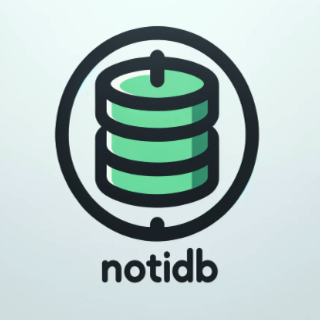
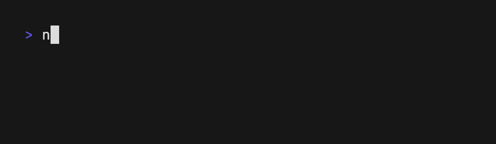
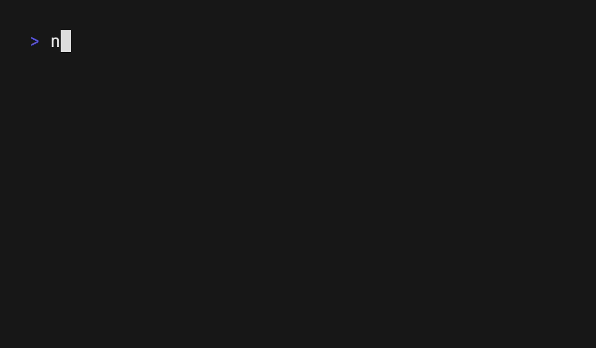
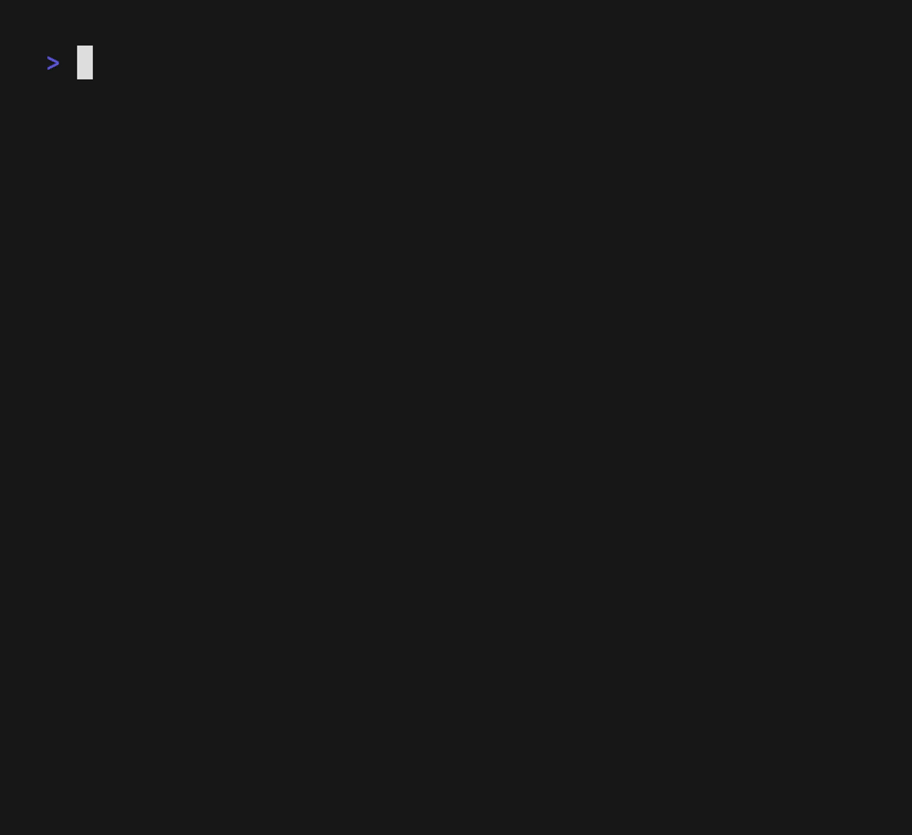

<p align="center">
  </a>
</p>
  <p align="center">NotiDB is a command line tool which simplifies the process of adding entries to a Notion database.</p>
    <p align="center">
    
# Description

This tool was mostly created as a way to quickly add entries to a database without having to open Notion and navigate to the database.

Its effective for things like quickly adding ad-hoc tasks, ideas, notes, todos, etc.



## Installation

```bash
brew tap chmarax/chmarax
brew install notidb
```

```bash
go install github.com/ChmaraX/notidb
```

Or download binaries from the [releases](https://github.com/ChmaraX/notidb/releases)

## Usage

### Notion API

NotiDB uses the Notion API to interact with your Notion workspace. You will need to create an integration in your Notion workspace and obtain an API key.

1. Go to [Notion's My Integrations page](https://www.notion.so/my-integrations) and click on "New integration".
2. Give your integration a name and click "Submit".
3. Copy the "Internal Integration Secret" (this is your API key).
4. Go to any of your Notion databases you want to interact with in your workspace
5. Click on the 3 dots in the top right corner of the database and select "Add connection", then select the name of the integration you just created.

Initialize NotiDB with your API key:

```bash
notidb init
```

NotiDB is now ready to use.

### Default database

You set a default database to use with NotiDB at the init step. You can change the default database at any time by running the following command:

```bash
notidb sd
```



This command will list all the allowed (connected) databases in your workspace.

### Adding entries

Adding a new entry, providing a title and a content/body:

```bash
notidb add -t "Title" -c "Content"

# shorthands
notidb a -t "Title" -c "Content"
notidb a "Title" "Content"
```


Adding a new entry using form generated from the database schema:

```bash
notidb add # this will prompt you to fill in the fields
```



Currently, NotiDB supports the following Notion API field types:

- Title
- Rich text
- Select
- Multi-select
- Date
- Checkbox
- Number
- Email
- Phone number
